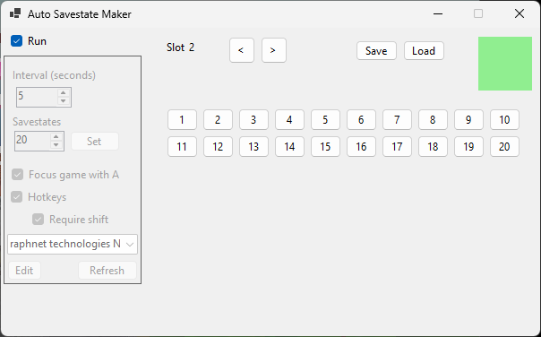
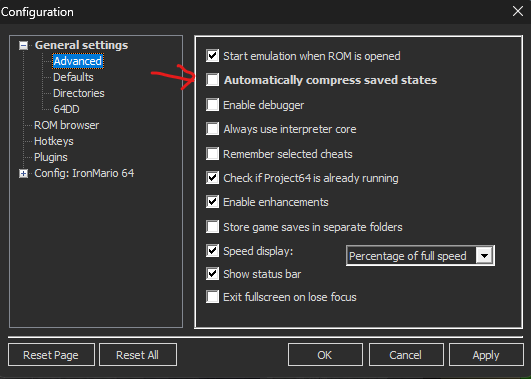

# Auto Savestate Maker

After being constantly frustrated by having to restart long segments I was practicing, I had the idea for a program that would create savestates for me. Now that I've finally developed it enough, I'm ready to share it.

The program makes savestates every few seconds to make long, failable challenges easier to practice. It works by sending the savestate hotkey to Project64 every few seconds, picking a new savestate slot every time. This has proven to be quite convenient in practicing long kaizo stars, and it's especially perfect for IronMario practice runs.

----------
### Compatibility
- This is intended only for Luna's Project64, but it should easily work on Project64 v1.6 on savestates 0-9.
- Parallel might work with some tinkering.

----------
### Setup
- To prevent the constant stutters when making a savestate, it's important to turn off the "Automatically compress saved states" option in Luna. This will, however, make savestates take up 8MB each instead of more like 1MB. (Shoutouts to Shin3 for this idea <3)

- Then simply run the .exe file.
- A config file will be created after running the .exe for the first time. There you can edit the default values and some hidden settings. Make sure to restart the program if you manually edit the config.
- At the bottom-left, pick your controller then pick "Edit" to set your hotkeys. These are optional, and you can leave the controller blank to not use them.

----------
### Usage
- Pick your options, then hit run at the top-left.
- (*Important*) Savestates will only be made when Project64 is focused. This is so that you can easily do other things while the program is running. The "focus game with A" option make this easier to manage.
- Use the left and right arrows to change the current save slot.
- Use the numbered buttons to load savestates in those slots.
- Use "Load" to load the current savestate slot.
- Use "Save" to manually create a savestate in the current slot.

----------
### Options
- Interval: How often savestates are made in seconds.
- Savestates: The number of savestate slots. Up to 80 are supported.
- Focus game with A: Pulls back focus to Project64 when A is pressed. (This is highly recommended since savestates will only be made while the game is focused)
- Hotkeys: Toggle controller hotkeys. See the "Edit" menu for the list. (Note that "Focus game with A" works without this setting on.)
- Require shift: Hotkeys will now require a shift hotkey to function. Pick the shift hotkey in the "Edit" menu.

#### Hidden Config Options
- "rewindAtLeastBySeconds": this handles whether to rewind by an extra slot. Sometimes a savestate is created a moment before you die, so this helps rewind to a point where you are more likely to be safe. Some low value of 2-4 is recommended.
- "extraDelaySecondsOnLoad": this delays the next interval when you load a savestate or manually change slots. This gives you more time to repeatedly load a savestate to get safe before the interval takes over again. Not needed if your interval is high.